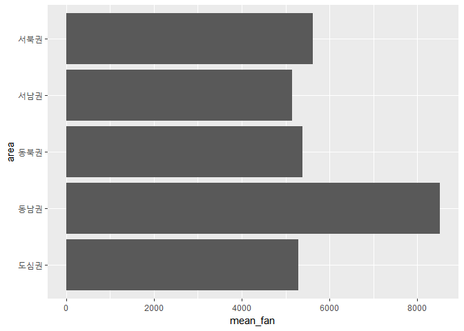
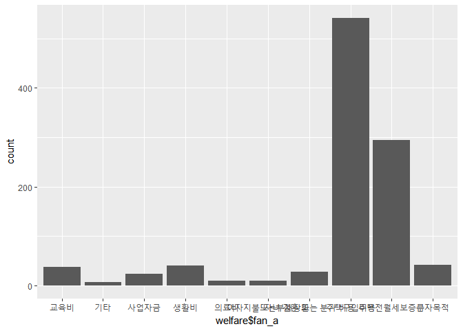
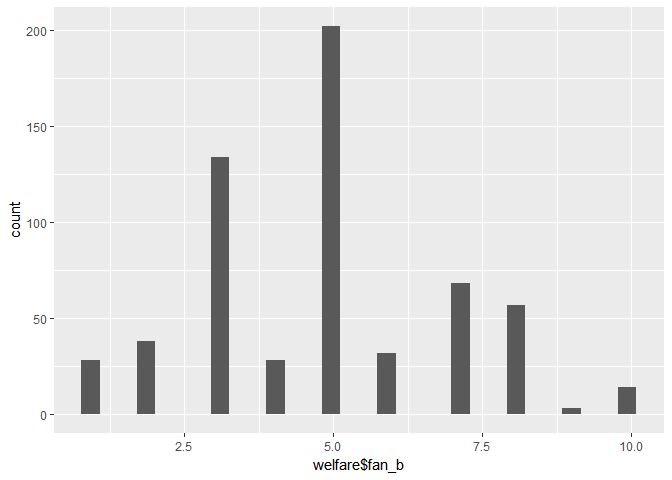

지역에 따른 부채액과 대출이유 분석
================

#### 요약

##### 서울시 지역에 따른 대출 정도에 대해 분석을 해보았다. 분석 결과 동남권의 부채액이 가장 많다는 것을 알 수 있었다. 서울시 전체의 대출 이유를 분석한 결과 주택구입비용 마련을 위해 대출을 한 것이 가장 높았고, 그다음은 생활비 마련으로 인한 대출이 가장 많았다. 지역별로 대출 이유를 분석해 본 결과 모두 주택구매비용에 부채액이 가장 많다는 결과가 나왔다. 이에 따라 지역별 부동산 자산을 분석해 보았고, 동남권의 부동산 자산이 가장 많다는 것을 알 수 있었다. 따라서 동남권의 주택가격이 가장 높으며, 부채를 통하여 주택구매비용을 얻기 때문에 부동산 자산이 가장 많다는 결론을 얻을 수 있었다.

#### 분석주제

##### 최근 주택마련을 위해 대출을 하는 경우가 대부분이다. 정부지원으로 저금리를 통해 주택마련 대출을 받을 수 있는 예도 있다. 따라서 지역에 따라서 부채액이 얼마나 다른지를 분석해보고 대출 이유를 분석해보아서 실제로도 주택마련을 위해 대출을 많이 하는지를 알아보고 그에 따른 부동산 자산의 차이를 알아보고자 하였다.

#### 데이터 선정

##### 서울연구데이터서비스에서 서울복지실태조사를 하였다. 이 데이터를 통해 2015년 서울시의 3,019가구의 복지실태를 알아볼 수 있다. 또한, 각 가구의 부채액과 부채 이유, 부동산자산에 대한 데이터가 포함되어있다.

#### 데이터 소개

##### 데이터: 2015 서울복지실태조사

##### 출처: 서울연구데이터서비스 \[<http://data.si.re.kr/sisurvey2015er17>\]

##### 특성: 본 통계는 2015년 서울시 5개 권역(도심권, 동북권, 서북권, 서남권, 동남권)을 조사표본으로 하여 서울시민의 생활실태와 복지 욕구 변화를 조사한 자료이다.

##### 구성: 이 데이터는 3,019개의 조사가고 수와 828개의 변수로 이루어져 있다.

#### 분석

#### 분석 목적 및 방법

##### '자산이 많은 지역의 대출액이 가장 많을 것이다'라는 예측을 한 후 '2015 서울복지실태조사 '데이터를 이용해서 서울시의 5개 권역별 부채액을 분석해 본 후, 부채액이 가장 많이 나온 지역의 대출 이유와 대출에 따른 자산의 정도를 분석해볼 것이다.

##### 데이터준비, 패키지 준비

``` r
library(ggplot2)
```

    ## Warning: package 'ggplot2' was built under R version 3.4.4

``` r
library(dplyr)
```

    ## Warning: package 'dplyr' was built under R version 3.4.4

    ## 
    ## Attaching package: 'dplyr'

    ## The following objects are masked from 'package:stats':
    ## 
    ##     filter, lag

    ## The following objects are masked from 'package:base':
    ## 
    ##     intersect, setdiff, setequal, union

``` r
library(readxl)
```

    ## Warning: package 'readxl' was built under R version 3.4.4

``` r
raw_welfare <- read_excel("2015_서울복지실태조사_데이터.xlsx")
```

    ## Warning in read_fun(path = path, sheet_i = sheet, limits = limits, shim =
    ## shim, : Expecting logical in UM1007 / R1007C559: got '媛쒖씤援먯궗'

    ## Warning in read_fun(path = path, sheet_i = sheet, limits = limits, shim =
    ## shim, : Expecting logical in AES2190 / R2190C825: got '�쒓낏�꾩썝�앺솢'

    ## Warning in read_fun(path = path, sheet_i = sheet, limits = limits, shim =
    ## shim, : Expecting logical in PG2194 / R2194C423: got '1�멸�援�'

    ## Warning in read_fun(path = path, sheet_i = sheet, limits = limits, shim =
    ## shim, : Expecting logical in AES2247 / R2247C825: got '�쒓낏�꾩썝�앺솢'

    ## Warning in read_fun(path = path, sheet_i = sheet, limits = limits, shim =
    ## shim, : Expecting logical in AES2257 / R2257C825: got '�쒓낏�꾩썝�앺솢'

##### 데이터 복사본 만들기

``` r
welfare <- raw_welfare
```

##### 데이터 파악(데이터의 양이 많기 때문에 임시로 비활성화)

``` r
#head(welfare)
#tail(welfare)
#View(welfare)
#str(welfare)
#summary(welfare)
dim(welfare)
```

    ## [1] 3019  828

##### 변수명 수정

``` r
welfare <- rename(welfare,
                  fan=B17,
                  fan_a=B17_1_1,
                  fan_b=B17_1_2)
```

##### 지역항목 이름 부여

``` r
table(welfare$area)
```

    ## 
    ##   1   2   3   4   5 
    ## 380 770 482 762 625

``` r
welfare$area <- ifelse(welfare$area==1,"도심권",
                       ifelse(welfare$area==2,"동북권",
                              ifelse(welfare$area==3,"서북권",
                                     ifelse(welfare$area==4,"서남권", "동남권"))))
```

##### 부채항목 이름 부여

``` r
welfare$fan_a <- ifelse(welfare$fan_a==1,"주택구입비용",
                        ifelse(welfare$fan_a==2,"주택전월세보증금",
                               ifelse(welfare$fan_a==3,"교육비",
                                      ifelse(welfare$fan_a==4,"의료비",
                                             ifelse(welfare$fan_a==5,"생활비",
                                                    ifelse(welfare$fan_a==6,"자녀 결혼 또는 분가 비용",
                                                           ifelse(welfare$fan_a==7,"이자지불또는부채상환",
                                                                  ifelse(welfare$fan_a==8,"투자목적",
                                                                         ifelse(welfare$fan_a==9,"기타",
                                                                                "사업자금")))))))))
```

#### 데이터 정제

##### 결측치 구하기

``` r
table(welfare$fan)
```

    ## 
    ##       0     100     200     300     400     500     600     700     750 
    ##    1960       1       3       4       2      26       5       1       1 
    ##     800     999    1000    1200    1300    1500    1800    2000    2300 
    ##       2       1      51       3       1      23       1     116       1 
    ##    2400    2500    3000    3500    4000    4500    5000    5500    6000 
    ##       1      25     159      19      55       8     196       1      32 
    ##    7000    8000    9000   10000   10100   10200   11000   12000   13000 
    ##      32      28       6     113       1       1       3      20       6 
    ##   14000   15000   16000   17000   18000   20000   21000   25000   26000 
    ##       3      36       4       2       3      11       1       6       1 
    ##   27000   28000   30000   34000   35000   40000   50000   52000   55000 
    ##       1       1       3       1       3       2       1       1       1 
    ##   60000 9999999 
    ##       1      29

``` r
table(welfare$fan_a)
```

    ## 
    ##                   교육비                     기타                 사업자금 
    ##                       41                        7                       23 
    ##                   생활비                   의료비     이자지불또는부채상환 
    ##                       43                       10                       10 
    ## 자녀 결혼 또는 분가 비용             주택구입비용         주택전월세보증금 
    ##                       29                      552                      301 
    ##                 투자목적 
    ##                       43

``` r
table(welfare$fan_b)
```

    ## 
    ##   1   2   3   4   5   6   7   8   9  10 
    ##  31  39 139  30 208  33  71  60   3  15

``` r
table(is.na(welfare$fan_a))
```

    ## 
    ## FALSE  TRUE 
    ##  1059  1960

##### 이상치 결측처리(부채에 이상치가 있으므로 결측처리한다.)

``` r
welfare$fan <- ifelse(welfare$fan==9999999, NA, welfare$fan)
```

##### 결측치 제거하기

``` r
welfare <- welfare %>% filter(!is.na(fan))
```

    ## Warning: package 'bindrcpp' was built under R version 3.4.4

``` r
welfare <- welfare %>% filter(!is.na(fan_a))
```

#### 지역에 따른 부채액 비교하기

##### 지역 부채 평균표 만들기

``` r
area_fan <- welfare %>% 
  group_by(area) %>% 
  summarise(mean_fan=mean(fan))
area_fan
```

    ## # A tibble: 5 x 2
    ##   area   mean_fan
    ##   <chr>     <dbl>
    ## 1 도심권    5282.
    ## 2 동남권    8516.
    ## 3 동북권    5382.
    ## 4 서남권    5143.
    ## 5 서북권    5622.

##### 그래프 분석

``` r
ggplot(data=area_fan, aes(x=area, y=mean_fan))+geom_col()
```

 \#\#\#\#\#분석결과 동남권의 부채액이 가장 많다는 것을 알수있다.

#### 대출이유 분석하기

``` r
qplot(welfare$fan_a)
```



``` r
qplot(welfare$fan_b)
```

    ## `stat_bin()` using `bins = 30`. Pick better value with `binwidth`.

    ## Warning: Removed 426 rows containing non-finite values (stat_bin).

 \#\#\#\#\#분석 결과 주택구입비용으로 대출을 가장 많이 하고 그다음 생활비 마련을 위해 대출을 많이 하는 것으로 나타났다.

#### 지역별 대출이유 분석하기

##### 지역별 대출이유 빈도 분석하기

###### 도심권

``` r
center_fan_a <- welfare %>% 
  filter(area=="도심권") %>% 
  group_by(fan_a) %>% 
  summarise(n=n())
center_fan_a
```

    ## # A tibble: 9 x 2
    ##   fan_a                        n
    ##   <chr>                    <int>
    ## 1 교육비                       7
    ## 2 기타                         2
    ## 3 생활비                       5
    ## 4 의료비                       1
    ## 5 이자지불또는부채상환         3
    ## 6 자녀 결혼 또는 분가 비용     4
    ## 7 주택구입비용                65
    ## 8 주택전월세보증금            32
    ## 9 투자목적                    13

###### 동남권

``` r
southeast_fan_a<- welfare %>% 
  filter(area=="동남권") %>% 
  group_by(fan_a) %>% 
  summarise(n=n())
southeast_fan_a
```

    ## # A tibble: 9 x 2
    ##   fan_a                        n
    ##   <chr>                    <int>
    ## 1 교육비                      12
    ## 2 기타                         1
    ## 3 사업자금                     2
    ## 4 생활비                       3
    ## 5 이자지불또는부채상환         2
    ## 6 자녀 결혼 또는 분가 비용     6
    ## 7 주택구입비용               105
    ## 8 주택전월세보증금            56
    ## 9 투자목적                     9

###### 동북권

``` r
notheast_fan_a<- welfare %>% 
  filter(area=="동북권") %>% 
  group_by(fan_a) %>% 
  summarise(n=n())
notheast_fan_a
```

    ## # A tibble: 10 x 2
    ##    fan_a                        n
    ##    <chr>                    <int>
    ##  1 교육비                       7
    ##  2 기타                         3
    ##  3 사업자금                    15
    ##  4 생활비                      13
    ##  5 의료비                       2
    ##  6 이자지불또는부채상환         2
    ##  7 자녀 결혼 또는 분가 비용     4
    ##  8 주택구입비용               127
    ##  9 주택전월세보증금            45
    ## 10 투자목적                     9

###### 서남권

``` r
southwest_fan_a<- welfare %>% 
  filter(area=="서남권") %>% 
  group_by(fan_a) %>% 
  summarise(n=n())
southeast_fan_a
```

    ## # A tibble: 9 x 2
    ##   fan_a                        n
    ##   <chr>                    <int>
    ## 1 교육비                      12
    ## 2 기타                         1
    ## 3 사업자금                     2
    ## 4 생활비                       3
    ## 5 이자지불또는부채상환         2
    ## 6 자녀 결혼 또는 분가 비용     6
    ## 7 주택구입비용               105
    ## 8 주택전월세보증금            56
    ## 9 투자목적                     9

###### 서북권

``` r
northwest_fan_a<- welfare %>% 
  filter(area=="서북권") %>% 
  group_by(fan_a) %>% 
  summarise(n=n())
northwest_fan_a
```

    ## # A tibble: 9 x 2
    ##   fan_a                        n
    ##   <chr>                    <int>
    ## 1 교육비                       9
    ## 2 사업자금                     2
    ## 3 생활비                       4
    ## 4 의료비                       2
    ## 5 이자지불또는부채상환         1
    ## 6 자녀 결혼 또는 분가 비용     7
    ## 7 주택구입비용               108
    ## 8 주택전월세보증금            59
    ## 9 투자목적                     7

##### 모두 주택구입비용에 부채액이 가장 많은 것으로 나타났다. 주택가격이 상대적으로 높은 동남권의 부채액이 가장 높은 것으로 나타난 이유이다. 따라서 동남권의 주택가격이 가장 높다는 것을 알 수 있다.

#### 지역별 부동산 자산

##### 변수명 수정

``` r
welfare <- rename(welfare,
                  property=B16_1)
```

##### 이상치 결측처리

``` r
welfare$property<- ifelse(welfare$property==9999999, NA, welfare$property)
```

##### 결측치 제거하기

``` r
welfare <- welfare %>% filter(!is.na(property))
```

##### 지역별 부동산 자산 평균표 만들기

``` r
area_property <- welfare %>% 
  group_by(area) %>% 
  summarise(mean_property=mean(property))
area_property
```

    ## # A tibble: 5 x 2
    ##   area   mean_property
    ##   <chr>          <dbl>
    ## 1 도심권        29874.
    ## 2 동남권        48657.
    ## 3 동북권        26265.
    ## 4 서남권        23484.
    ## 5 서북권        18430.

##### 그래프 분석

``` r
ggplot(data=area_property, aes(x=area, y=mean_property))+geom_col()
```


##### 분석 결과 동남권의 부동산 자산이 가장 많다는 것을 알 수 있다. 동남권의 부동산 자산이 가장 많은 이유는 부채를 통하여 주택구입비용을 얻기 때문이다.

#### 한계점

##### 1.표본이 서울시로만 한정되어 있으므로 분석 결과의 정확도가 떨어질 수 있다.

##### 2.동남권에 부채가 많은 이유를 더 정확히 밝히지 못했다.

#### 추후 분석 방향

##### 1.다른 데이터를 이용하여 서울시뿐만 아니라 경기도 또는 전국의 지역별 부채 비중을 분석해보고 싶다.

##### 2.부동산 자산에 따른 부채가 많게 나왔는데 부동산 부채에 대한 대책을 알아보고 싶다.

##### 3.비우량 주택담보대출이 일어난 이유에 대해 분석해보고 싶다.
